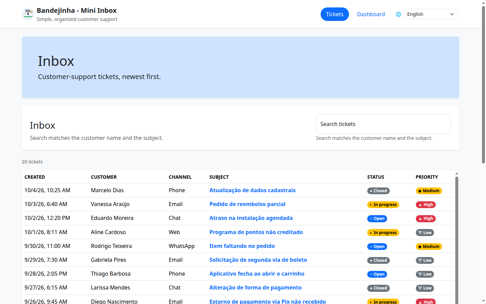

# Bandejinha - Mini Inbox

A small customer-support inbox.

## Screenshots

### Interface



### n8n


## Quickstart

```bash
make compose-up          # or: docker compose up --build -d
```

| Serviço | URL |
|---|---|
| Interface | http://localhost:3000 |
| API (Swagger) | http://localhost:8000/docs |
| n8n | http://localhost:5678 (first access you will create the local owner account) |


*note: It also runs the ETL, creating the database with ~20 tickets and dummy data (make it ready to be experimented)*


## Data (Kaggle)

The ETL input is the Kaggle **[Customer Support Ticket Dataset](https://www.kaggle.com/datasets/suraj520/customer-support-ticket-dataset)**
(author *suraj520*, license CC0), committed unmodified as `data/raw/customer_support_tickets.csv`.

```bash
make kaggle-download     # download the latest version into data/raw/ (no Kaggle account needed)
make etl                 # data/raw/customer_support_tickets.csv -> data/processed/metrics.json
```

Without make:

```bash
curl -fL -o /tmp/dataset.zip https://www.kaggle.com/api/v1/datasets/download/suraj520/customer-support-ticket-dataset
unzip -o /tmp/dataset.zip customer_support_tickets.csv -d data/raw
```

Details and limitations: [data/README.md](data/README.md).

## Repository map

```
backend/                FastAPI app (api → services → repositories / integrations), Alembic, seeds, tests
frontend/               Next.js app (app/ routes, components/, lib/api the only HTTP layer, i18n, brand)
data/                   etl.py, Kaggle CSV input (raw/), fixtures, tests, processed/metrics.json
n8n/                    workflow.json + README + real execution screenshot
```
