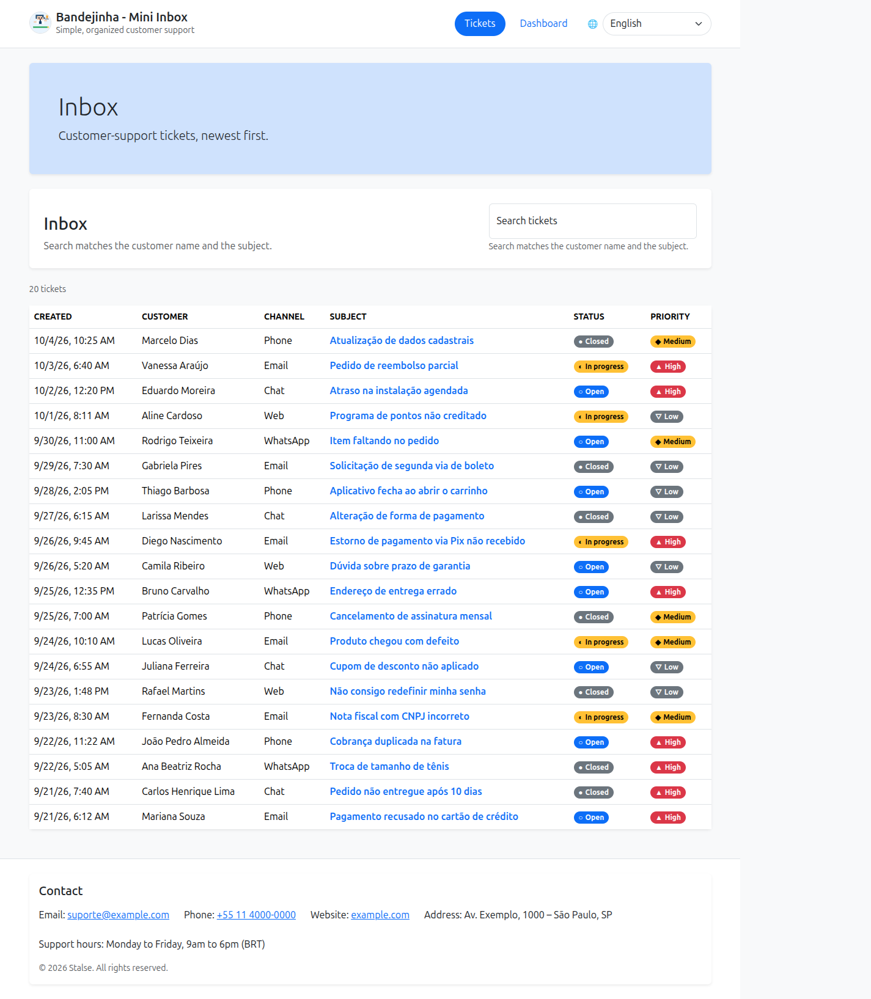

# Mini Inbox: guia rápido de avaliação

Caixa de entrada de tickets de suporte: **FastAPI + SQLite**, **Next.js (App Router)**, **ETL com pandas** e
**n8n**. Este guia mostra como rodar o projeto e como testar localmente **cada critério avaliado**.

---

## 1. Como rodar

### Opção A: Docker (recomendado, sobe tudo)

Pré-requisito: Docker com Compose.

```bash
docker compose up --build -d     # ou: make compose-up
```

O comando roda o ETL, cria o banco SQLite com os 20 tickets de seed, sobe a API e o frontend, e importa e
**publica** o workflow do n8n automaticamente.

| Serviço | URL |
|---|---|
| Interface | http://localhost:3000 |
| API (Swagger) | http://localhost:8000/docs |
| n8n | http://localhost:5678 (no primeiro acesso, crie uma conta local de owner) |

Para parar: `docker compose down`. Para zerar banco, métricas e n8n: `docker compose down -v`.

### Opção B: sem Docker (exceto o n8n)

Pré-requisitos: [uv](https://docs.astral.sh/uv/) (Python 3.12), Node ≥ 22.

```bash
make install     # dependências + cria backend/.env e frontend/.env.local
make etl         # gera data/processed/metrics.json
make backend     # migra + seed + API em http://localhost:8000   (terminal 1)
make frontend    # http://localhost:3000                        (terminal 2)
docker compose up -d n8n   # n8n em http://localhost:5678 (já importa e publica o workflow)
```

O backend nativo já aponta para `http://localhost:5678/webhook/stalse-ticket-updated`
(definido em `backend/.env`).

---

## 2. Critério: MVP funcional

### 2.1 Listar e buscar tickets

```bash
curl http://localhost:8000/tickets                  # 20 tickets, do mais novo ao mais antigo
curl "http://localhost:8000/tickets?search=pedido"  # busca no nome do cliente e no assunto
```

Na interface: abra **http://localhost:3000/tickets**. A tabela mostra `created_at`, `customer_name`,
`channel`, `subject`, `status` e `priority`. Digite no campo de busca e a lista é filtrada.

### 2.2 Editar status / priority

```bash
curl -X PATCH http://localhost:8000/tickets/7 \
  -H 'Content-Type: application/json' \
  -d '{"status":"in_progress"}'
```

Valores aceitos: `status` = `open | in_progress | closed` · `priority` = `low | medium | high`.
Campos diferentes desses ou corpo vazio retornam **422**.

Na interface: clique no assunto de um ticket (**/tickets/[id]**). Na área **Triagem** há um botão para cada
status e um para cada prioridade; clique nos novos valores e depois em **Salvar alterações**. Uma mensagem confirma a alteração.

### 2.3 Dashboard lê `/metrics`

```bash
curl http://localhost:8000/metrics
```

A API só **lê** `data/processed/metrics.json` (gerado pelo pandas); nenhum cálculo é feito na requisição.
Na interface: **http://localhost:3000/dashboard** mostra os cards com os mesmos números.

---

## 3. Critério: n8n recebendo e realizando a ação

**Quando o backend chama o n8n:** num `PATCH` que faz o ticket **virar** `status=closed` e/ou
`priority=high`. Se o ticket já estava nesse valor, nada é enviado.

### Teste ponta a ponta (API → n8n)

```bash
# Ticket 3 está "open/medium": fechar dispara o webhook
curl -X PATCH http://localhost:8000/tickets/3 \
  -H 'Content-Type: application/json' -d '{"status":"closed"}'

# Ticket 11 está "low": subir para high dispara o webhook
curl -X PATCH http://localhost:8000/tickets/11 \
  -H 'Content-Type: application/json' -d '{"priority":"high"}'
```

Depois abra o n8n → workflow **Stalse Mini Inbox – ticket.updated** → aba **Executions**. Cada PATCH acima gera uma
execução com sucesso.

Também dá para testar pela interface: abra o ticket 3, clique no botão **Fechado** e em **Salvar alterações**.

### Exemplo de payload enviado pelo backend

`POST http://localhost:5678/webhook/stalse-ticket-updated`

```json
{
  "event": "ticket.updated",
  "trigger_reasons": ["status_closed"],
  "ticket": {
    "id": 3,
    "status": "closed",
    "priority": "medium",
    "customer_name": "Ana Beatriz Rocha",
    "subject": "Troca de tamanho de tênis",
    "updated_at": "2026-10-09T12:00:00+00:00"
  }
}
```

`trigger_reasons` pode ter `status_closed`, `priority_high` ou os dois.

### O que o workflow faz

```
Webhook (POST) → Code "Validate & build notification" → IF "Is valid event?"
                                                          ├─ sim → Respond 200 {received, summary, channel}
                                                          └─ não → Respond 400 {received:false, error}
```

O nó Code valida o evento e monta um resumo. O canal é `escalations` para prioridade alta e
`csat-survey` para fechamento (simula o envio de Slack/e-mail).

### Teste direto no webhook (sem passar pela API)

```bash
curl -X POST http://localhost:5678/webhook/stalse-ticket-updated \
  -H 'Content-Type: application/json' \
  -d '{"event":"ticket.updated","trigger_reasons":["priority_high"],
       "ticket":{"id":11,"status":"open","priority":"high","customer_name":"Camila Ribeiro",
                 "subject":"Dúvida sobre prazo de garantia","updated_at":"2026-10-09T12:00:00Z"}}'
```

Resposta esperada:

```json
{"received":true,"summary":"Ticket #11 (Camila Ribeiro) was escalated to high priority: \"Dúvida sobre prazo de garantia\"","channel":"escalations"}
```

Arquivos: [n8n/workflow.json](n8n/workflow.json) (export) e [n8n/screenshot.png](n8n/screenshot.png) (print).
Para importar manualmente: n8n → **Import from File** → `n8n/workflow.json` → **Publish**.

---

## 4. Dados: pandas + Kaggle

- **Dataset Kaggle:** [Customer Support Ticket Dataset](https://www.kaggle.com/datasets/suraj520/customer-support-ticket-dataset)
  (autor *suraj520*, licença **CC0: Public Domain**)
- **Arquivo usado:** [data/raw/customer_support_tickets.csv](data/raw/customer_support_tickets.csv), o CSV do
  Kaggle **sem modificação** (8.469 linhas), versionado no repositório
- **Script:** [data/etl.py](data/etl.py) lê CSV/JSON, faz parse de data e calcula as métricas
  (**quantidade por dia**, **top 5 categorias**, por canal, prioridade e status). O resultado é salvo em
  [data/processed/metrics.json](data/processed/metrics.json).

```bash
make kaggle-download   # baixa a versão mais recente do Kaggle para data/raw/ (não precisa de conta)
make etl               # data/raw/customer_support_tickets.csv -> data/processed/metrics.json
```

Sem `make`:

```bash
curl -fL -o /tmp/dataset.zip \
  https://www.kaggle.com/api/v1/datasets/download/suraj520/customer-support-ticket-dataset
unzip -o /tmp/dataset.zip customer_support_tickets.csv -d data/raw
uv run --project data python data/etl.py
```

> **Limitação do dataset:** a única coluna de data é `Date of Purchase` (data da compra), então
> "quantidade por dia" conta compras que geraram tickets, de 01/01/2020 a 30/12/2021.

---

## 5. Critério: código claro e simples

```
backend/   FastAPI
  app/api/routes/       endpoints (tickets, metrics, health)
  app/services/         regras de negócio (quando disparar o webhook, leitura das métricas)
  app/repositories/     acesso ao SQLite
  app/integrations/     cliente HTTP do n8n
  seeds/tickets.json    20 tickets iniciais
frontend/  Next.js App Router
  app/tickets, app/tickets/[id], app/dashboard   páginas
  components/                                    tabela, detalhe, métricas
  lib/api/                                       única camada que chama a API
data/      etl.py, raw/, processed/metrics.json
n8n/       workflow.json, screenshot.png
```

Testes: `make test` (backend, ETL e frontend).

---

## 6. Prints

| Interface | n8n |
|---|---|
|  |  |

Mais prints em [_screenshots/interface/](_screenshots/interface/).

---

## 7. Problemas comuns

| Sintoma | Solução |
|---|---|
| n8n retorna `404 webhook not registered` | O workflow não está publicado. Rode `make n8n-import` ou clique em **Publish** no n8n |
| Log do backend: `Webhook delivery failed` | O n8n está fora do ar. O ticket é salvo mesmo assim; suba o n8n e repita o PATCH |
| Dashboard mostra erro | Falta `metrics.json`: rode `make etl` |
| Quer voltar aos 20 tickets originais | `make reset` (nativo) ou `docker compose down -v && docker compose up --build -d` |
