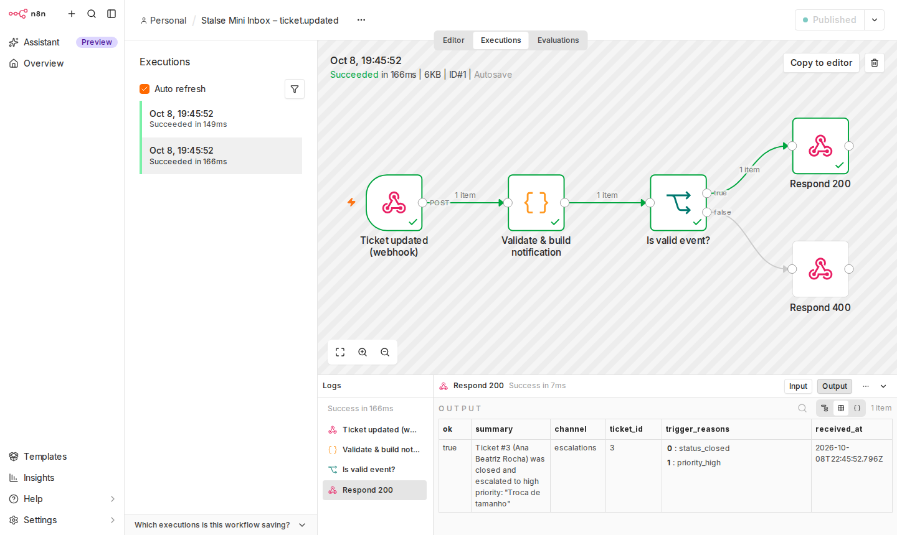

# n8n automation

`workflow.json` receives the backend's `ticket.updated` event (sent when a ticket **becomes**
`closed` and/or **becomes** `high` priority; see [ADR-0004](../docs/adr/0004-webhook-delivery-semantics.md))
and runs a simple, credential-free action:

```
Webhook POST /webhook/stalse-ticket-updated
  → Code "Validate & build notification"   (validates payload, builds summary + target channel)
  → IF "Is valid event?"
       true  → Respond 200 {received, summary, channel}
       false → Respond 400 {received:false, error}
```

The routing ("escalations" for high priority, "csat-survey" for closures) stands in for a
real action such as a Slack message or a CSAT e-mail. Adding one is a single node, plus a credential
created in the n8n UI (never in this export).



*Real screenshot from n8n 2.42.5: a successful execution for an event with both trigger reasons.*

## Run it

### docker compose (automatic)

```bash
make compose-up        # starts n8n, imports and publishes the workflow (n8n-init service)
open http://localhost:5678   # first visit: create a local owner account (stays on your machine)
```

The backend is preconfigured with `N8N_WEBHOOK_URL=http://n8n:5678/webhook/stalse-ticket-updated`.

### Manual import (any n8n ≥ 1.x)

1. In the n8n UI, go to **Workflows → Import from File** and select `n8n/workflow.json`.
2. Click **Publish** (or **Activate** on n8n 1.x). The production URL becomes
   `http://<n8n-host>:5678/webhook/stalse-ticket-updated`.
3. Point the backend at it: `N8N_WEBHOOK_URL=http://localhost:5678/webhook/stalse-ticket-updated`
   (native) or `http://n8n:5678/...` (inside compose).

CLI alternative (inside the n8n container):

```bash
n8n import:workflow --input=/workflows/workflow.json
n8n publish:workflow --id=stalseTicketUpdated     # n8n 2.x (1.x: update:workflow --active=true)
```

## Test the webhook

```bash
# Directly
curl -X POST http://localhost:5678/webhook/stalse-ticket-updated \
  -H 'Content-Type: application/json' \
  -d '{"event":"ticket.updated","trigger_reasons":["status_closed"],
       "ticket":{"id":3,"status":"closed","priority":"medium","customer_name":"Ana",
                 "subject":"Troca","updated_at":"2026-10-08T12:00:00Z"}}'
# → 200 {"received":true,"summary":"Ticket #3 (Ana) was closed: \"Troca\"","channel":"csat-survey"}

# End to end through the API (closing ticket 3 fires the webhook)
curl -X PATCH http://localhost:8000/tickets/3 -H 'Content-Type: application/json' -d '{"status":"closed"}'
```

Then open **Executions** in n8n to inspect the run.

## Security

The export contains **no credentials, tokens, private URLs or environment-specific values**. CI checks the file for secret-looking strings.

## Azure environments

n8n is **not** deployed to Azure (decision recorded in [spec 004](../specs/004-n8n-automation/spec.md)). In Azure, `N8N_WEBHOOK_URL` comes from Key Vault (`n8n-webhook-url`) and points to an externally hosted n8n (for example n8n Cloud). Leave it empty to disable notifications; the API keeps working.

## Troubleshooting

| Symptom | Fix |
|---|---|
| `404 webhook not registered` | The workflow is not published or active. Publish it, or use `/webhook-test/...` while "Listen for test event" is on |
| Backend logs `Webhook delivery failed` | n8n is down or the URL is wrong. The ticket update is still saved (by design) |
| n8n shows a setup screen | First run: create the local owner account |
